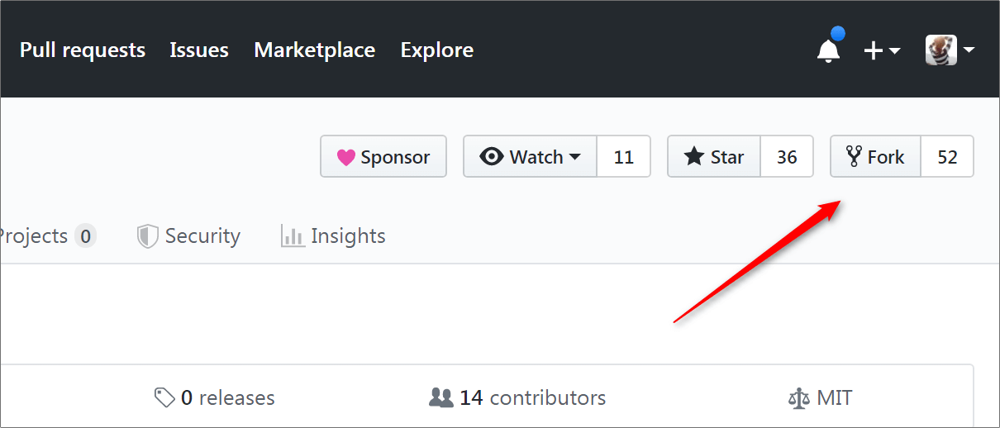
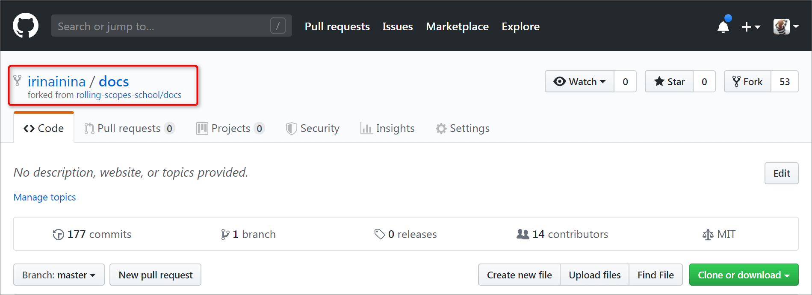

# How to make changes to the RS School documentation

If you notice an inaccuracy or a typo in the documentation of the course https://docs.rs.school/#/, or in the details of the assignment, it is advisable to correct them.

Documentation repository link: https://github.com/rolling-scopes-school/docs

If you wanto to discuss the changes, you can do this in "issue" area, for example:
https://github.com/rolling-scopes-school/docs/issues/33
But if the proposed fix is obvious to you, it's better to create a **Pull Request**.

## How to add changes to someone else's repository

By sending a Pull Request, you offer the author of the repository and all interested parties to consider the changes you have made and add them into the project. If the changes are reasonable and appropriate, your Pull Request will be accepted.

I will show how to do this using the example of the repository https://github.com/rolling-scopes-school/docs

### 1. Make your own copy of the repository.
To do this, click the "Fork" button on the repository page.



As a result, a copy of the repository will appear on your account


Link of your copy of the repository contains the name of your github account.
* Original repository https://github.com/rolling-scopes-school/docs
* Created copy https://github.com/irinainina/docs

### 2. Clone your own copy of the repository on your computer

`` `git clone https: // github.com / irinainina / docs```

## 3. Bind a local copy to the original repository
To do this, go to the folder of the cloned repository and execute two commands

```git remote add upstream https: // github.com / rolling-scopes-school / docs```
```git fetch upstream```


### 4. Create your own development branch

The branch name, as a rule, indicates the content of the fix.
Suppose our branch is called fix-typo.
To create a new "fix-typo" branch is possibile by executing command:

`` `git checkout -b fix-typo```

At this point, we can already edit the code and add the necessary changes to it.

### 5. Add changes to your own repository copy

Once you have done the work (or part of it), send it to your own copy of the repository on GitHub.
To do this, run the commands:

```git add .```
```git commit -m" feat: add fix-typo "```
```git push origin fix-typo```

### 6. Return changes: Pull request

So, everything is done. You have written the code, you have it in the fix-typo branch both on your computer and on GitHub. Only thing that left is to send it to the original repository.

Go to the page of your copy of the repository on GitHub, select the fix-typo branch and click the Pull Request button.


Add a name and description of your changes and click on the "Create pull request" button


### What's next?

Keep track of your pull request. What people will comment on, what the maintainer will say, whether or not the edits you proposed will accept.

In the same way, you can fix errors in the repository with the course assignments https://github.com/rolling-scopes-school/tasks
or even offer your own tasks.

Only the name of the repository will change, but the way of working with the repository itself remains unchanged. Because it is the base of collaboration on GitHub and the creation of open-source projects.

[Source](https://habr.com/en/post/125999/)


