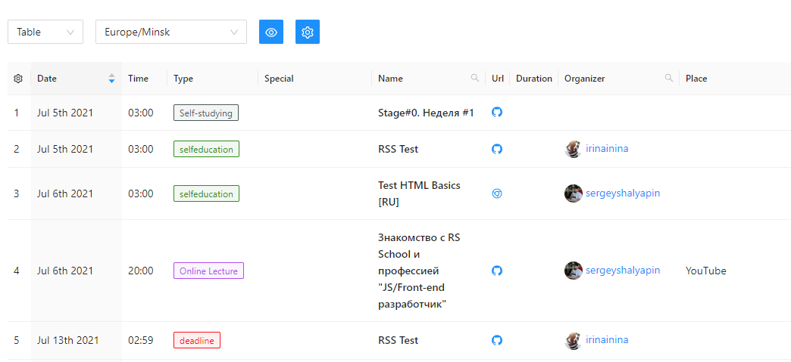
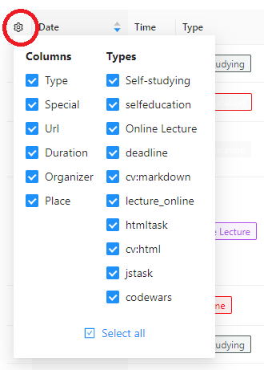

## Расписание в RS APP

Для успешного прохождения выбранного курса в **RS APP** есть **расписание**, в которое можно попасть из главного меню

1. Выбрать нужный курс
2. Перейти по ссылке

#### Общий вид расписания

#### Панель управления расписанием

1. Выбор вида расписания. Выбор сохраняется для устройства/браузера

   - **Table** - максимально подробный вид расписания (открывается по умолчанию)
   - **List** - наиболее компактный вид для мобильных устройств (открывается по умолчанию на мобильных)
   - **Calendar** - классический календарь для обзора расписания

2. Выбор часового пояса
3. Переключатель, для скрытия прошедших событий
4. Настройка цветов тегов событий. Для каждого события/задания можно выбрать цвет из предопределенного набора цветов. Выбор сохраняется для устройства/браузера

Более тонкий вид настойки есть у **Table**, где можно скрыть часть колонок и события/задания по типам

#### Детали события/задания

При переходе к странице деталей события/задания отображается максимально подробные данные.

#### Использование расписания студентами

Есть возможность поиска по названию события/задания или организатору, сортировка по датам (вид **Table**). Для перехода к деталям события/задания необходимо кликнуть по названию события/задания.

### Дополнительные возможности расписания для администрации

Для максимального удобства работы с расписанием предусмотрены следующие возможности редактирования расписания:

1. Расширенная панель управления

    **1** - Кнопка экспорта расписания курса в файл csv для редактирования целого курса
    **2** - Кнопка импорта расписания курса из файла csv (добавляются новые или обновляются существующие события/задания)
    **3** - Кнопка добавления единичного события/задания

2. Быстрое редактирование для вида **Table**

3. Добавление нового события/задания

4. Редактирование события/задания также доступно на странице деталей события/задания

#### Некоторые особенности заполнения расписания

- Основные поля в событиях/заданиях изменяются сразу **во всех курсах**. Например, **Name**, **Type**, **Url**.

- Поле **Special** позволяет дополнительно уточнить тип события/задания. Например, сделать его опциональным с помощью тега _optional_. Допустимо добавлять теги не только из предусмотренного списка.
